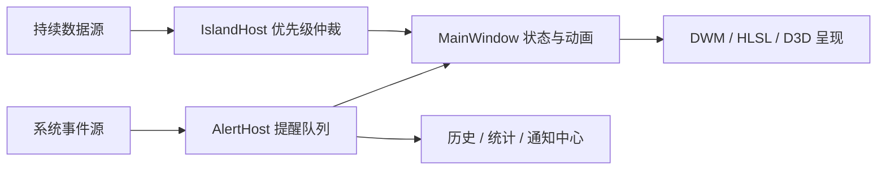

<div align="center">

# DynamicIsland 🏝️

面向 Windows 的顶部灵动岛：用一个常驻、可展开的浮动胶囊集中显示天气、媒体、系统状态与即时提醒。


</div>

> [!IMPORTANT]
> 项目仍在持续开发。亚克力、全透明、云母平涂及大部分信息/提醒功能可正常使用；Pro 模式中的 GPU 液态玻璃后端目前仍处于诊断阶段，请参阅[当前状态与限制](#当前状态与限制)。

## 项目简介

DynamicIsland 是一个使用 .NET 10 与 WPF 编写的 Windows 桌面挂件。它固定在目标显示器顶部中央，平时保持紧凑，并按照信息优先级自动切换内容：

```text
正在播放的媒体 > 达到阈值的系统资源 > 天气 > 时钟
```

鼠标悬停时胶囊会放大并强化高光；单击后展开为仪表盘，可浏览媒体控制、最近提醒、天气预报和提醒统计。电池、截图、USB、蓝牙、网络、下载完成等事件会通过独立的优先级队列即时展示。

## 功能

### 灵动岛交互

| 状态 | 行为 |
|---|---|
| 收起 | 基准尺寸 `200 × 40`，根据文本长度自动扩宽，显示当前最高优先级信息 |
| 悬停 | 放大至 `228 × 48`，增强边框、高光与材质强度 |
| 展开 | 动画扩展至 `720 × 240`，显示分页仪表盘与固定系统资源条 |
| 提醒 | 摘要提醒直接替换胶囊内容；交互提醒可扩宽并显示操作按钮 |
| 全屏抑制 | 目标屏存在全屏应用时自动隐藏；有提醒时仍可短暂出现 |
| 省电状态 | 5 分钟无交互后降低液态玻璃刷新频率并轻微变暗，重新交互后恢复 |

基本操作：

- 鼠标移入：进入悬停状态；
- 左键单击：展开仪表盘；
- 鼠标移出：延迟收回；
- 点击页码圆点，或将鼠标放在圆点区域滚动：切换仪表盘页面；
- 右键灵动岛：打开强制展开、设置、提醒测试和退出菜单；
- 左键托盘图标：打开设置；右键托盘图标：设置、测试提醒、开机启动或退出。

### 信息与仪表盘

| 模块 | 收起状态 | 展开状态 |
|---|---|---|
| 天气 | 当前温度与天气状况 | 城市、体感温度、湿度、风速及三日预报 |
| 媒体 | 播放中的歌曲与艺人 | 封面、进度、上一首/下一首、播放暂停、循环与随机播放 |
| 系统资源 | CPU 或 RAM 超过阈值时自动显示 | 固定显示 CPU、RAM、GPU、VRAM 与上下行网速 |
| 时钟 | 无其他活跃信息时兜底显示 | 当前日期与秒数 |
| 最近提醒 | — | 查看本应用产生的提醒历史并重新执行可用操作 |
| 提醒统计 | — | 查看累计提醒数、统计天数和各类型计数，可手动清空 |

媒体功能基于 Windows Global System Media Transport Controls，适用于向系统注册了 SMTC 的播放器和浏览器媒体会话，例如 Spotify、网易云音乐、QQ 音乐、浏览器视频及 Windows 媒体播放器。

> [!NOTE]
> “最近提醒”只保存 DynamicIsland 自己产生的提醒，不会读取其他应用的 Windows 通知。

### 即时提醒

- 电源接入、拔下与低电量；
- `Win + Shift + S` 等产生的剪贴板图像；
- U 盘或可移动磁盘连接、断开；
- 已配对蓝牙 Classic / LE 设备连接、断开；
- 网络连接、断开及可用时的 Wi-Fi 名称；
- Downloads 或自定义文件夹中新文件写入完成，可在资源管理器中定位文件；
- Cherry Studio agent 完成一轮回复（可选，需要本地 API Key）；
- 可选同步到 Windows 通知中心。

提醒按照优先级排队。高优先级事件可以暂时打断当前提醒，被打断的提醒会重新回到队列；所有真正展示过的提醒会进入历史并计入本地统计。

### 外观与个性化

- 亚克力模糊、全透明、云母平涂三种常规材质；
- Pro 模式中的液态玻璃材质，支持 HLSL 兼容后端及实验性 GPU 后端；
- 跟随系统、浅色、深色主题；
- 自定义文字颜色、亚克力底色浓度及模糊开关；
- 液态玻璃模糊半径、底色浓度、边缘高光和抓屏帧率；
- 帧率拉满时可启用流动彩虹边框；
- 可调“抽纸”缩放与统一动画缓动曲线；
- 长标题自动跑马灯显示。

### 桌面集成

- 多显示器选择及显示器热插拔迁移；
- 按目标显示器高度与 DPI 自动缩放；
- 抓屏帧率上限自动匹配目标显示器刷新率；
- 开机自启动，无需管理员权限；
- 设置、提醒统计和崩溃日志本地持久化；
- 系统托盘常驻入口。

## 工作方式



- `IIslandSource` 表示持续数据源，由 `IslandHost` 选择当前最高优先级内容；
- `IIslandPanel` 表示展开仪表盘中的页面；
- `IIslandAlert` 表示有时限、可排队和抢占的即时提醒；
- `DisplaySettings` 负责设置模型、实时联动和 JSON 持久化；
- `LiquidGlassRenderer` 根据设置选择 HLSL 或 GPU 后端，并在 Auto 模式中处理回退。

## 系统要求

### 运行

- Windows 10 / Windows 11，x64；
- 支持 WPF 的桌面环境；
- 媒体控制需要播放器提供 Windows SMTC 会话；
- GPU/VRAM 指标需要显卡驱动暴露相应性能计数器，无法读取时显示 `--`；
- 天气功能需要访问 `ip-api.com` 与 `api.open-meteo.com`。

### 从源码构建

- [.NET 10 SDK](https://dotnet.microsoft.com/download/dotnet/10.0)；
- Windows x64 开发环境；
- 可选：安装带“.NET 桌面开发”工作负载的 Visual Studio。

## 快速开始

```powershell
git clone https://github.com/A-pei-lun/DynamicIsland.git
cd DynamicIsland

dotnet restore .\DynamicIsland\DynamicIsland.csproj
dotnet run --project .\DynamicIsland\DynamicIsland.csproj
```

启动后可通过以下任一入口打开设置：

1. 左键单击系统托盘中的 DynamicIsland 图标；
2. 右键灵动岛，选择“设置…”；
3. 右键托盘图标，选择“设置”。

## 构建与发布

构建 Release：

```powershell
dotnet build .\DynamicIsland.slnx -c Release
```

发布依赖 .NET 10 Desktop Runtime 的版本：

```powershell
dotnet publish .\DynamicIsland\DynamicIsland.csproj `
  -c Release `
  -o .\publish
```

发布自包含的 Windows x64 版本：

```powershell
dotnet publish .\DynamicIsland\DynamicIsland.csproj `
  -c Release `
  -r win-x64 `
  --self-contained true `
  -o .\publish
```

生成后运行 `publish\DynamicIsland.exe`。

仓库中的 `构建/` 目录包含 Inno Setup 相关脚本，目前仍保留维护者路径和发布信息占位内容。制作正式安装包前请先检查脚本路径、发布者、仓库 URL 和版本号。

## 设置与本地数据

| 内容 | 位置 |
|---|---|
| 应用设置 | `%AppData%\DynamicIsland\settings.json` |
| 提醒统计 | `%AppData%\DynamicIsland\stats.json` |
| 未处理异常日志 | `%AppData%\DynamicIsland\error.log` |
| 开机启动 | `HKCU\Software\Microsoft\Windows\CurrentVersion\Run\DynamicIsland` |

设置变更会延迟约 500 ms 自动写入磁盘，程序退出时还会再保存一次。`error.log` 只在捕获到未处理异常时创建，超过 1 MiB 后自动截断。

## 网络与隐私说明

- 天气模块启动后会访问 `http://ip-api.com`，依据公网 IP 获取城市和经纬度，再通过 HTTPS 请求 Open-Meteo 天气数据；定位结果只保存在当前进程内；
- Cherry Studio 集成只访问 `http://127.0.0.1:23333`，默认关闭；API Key 会以明文保存在本地 `settings.json`，请妥善保护该文件；
- 下载、剪贴板、电池、USB、蓝牙、网络和性能指标均在本机监听或采样；
- Windows 通知中心同步可以在设置中关闭。

## 项目结构

```text
DynamicIsland/
├─ DynamicIsland.slnx                 # 主解决方案
├─ DynamicIsland/                     # WPF 主程序
│  ├─ MainWindow.xaml(.cs)            # 主窗口、状态机、交互与动画
│  ├─ IslandDashboard.xaml(.cs)       # 展开态分页仪表盘
│  ├─ SettingsWindow.xaml(.cs)        # 设置窗口
│  ├─ DisplaySettings.cs              # 设置模型与持久化
│  ├─ WindowBackdrop.cs               # Acrylic / Transparent / Mica 材质
│  ├─ Island/                         # Source、Panel、Alert 抽象及宿主
│  ├─ Sources/                        # 时钟、天气、媒体和系统资源
│  ├─ Alerts/                         # 电池、剪贴板、USB、蓝牙等提醒源
│  └─ LiquidGlass/                    # HLSL 与实验性 D3D 液态玻璃管线
├─ GlassBench/                        # WinGC、D3D9/11 与共享纹理诊断程序
├─ AcrylicSpike/                      # DWM/Acrylic 材质验证程序
├─ GlassSpike/                        # 液态玻璃视觉验证程序
├─ 构建/                              # 发布与 Inno Setup 脚本
└─ 文档/                              # 历史中英文说明
```

## 当前状态与限制

### 实验性 GPU 液态玻璃

Pro 模式中的 GPU 后端当前是开发诊断版本，不应作为稳定功能宣传或发布：

- D3D11 V-pass shader 仍是纯洋红可见性测试；
- `GpuBlur` 的 texel 参数仍被诊断值 `0.5` 覆盖；
- WinGC → D3D11 Copy → D3D9/D3DImage 呈现链路仍在逐阶段验收；
- 强制 GPU 模式可能没有玻璃输出；Auto 模式可能回退到 HLSL 兼容后端。

### 图形互操作最小复现

本仓库包含三个独立的最小复现项目，用于验证 Windows 图形 API 互操作边界。详见 [`repros/`](repros/README.md)：

| 项目 | 目标 | 结果 |
|---|---|---|
| `WinGCSurfaceInterop` | WinGC surface → ID3D11Texture2D ABI 路径 | PASS ✅ |
| `D3D11D3D9D3DImage` | D3D9Ex 共享 → D3D11 → D3DImage 显示 | M3 PASS, M4 PASS ✅ |
| `WpfCompositionBackdrop` | WPF + Composition SpriteVisual + Backdrop | M5-C 🟡（DispatcherQueue 边界） |

常规使用建议保持默认亚克力材质；如需测试液态玻璃，请启用 Pro 模式，并优先选择 HLSL 兼容后端。

### 其他限制

- 天气当前使用公网 IP 自动定位，尚未提供手动城市选择或单独关闭开关；
- 部分旧显卡或驱动不提供 GPU Engine / Adapter Memory 性能计数器；
- 蓝牙和媒体能力受 Windows、设备驱动及第三方应用实现影响；
- 仓库当前尚未包含自动化测试；`GlassBench` 与两个 Spike 项目主要用于人工验证；
- 仓库当前未提供 `LICENSE` 文件。公开分发、复用或接受外部贡献前，建议先明确开源许可证。

### 调查文档

- [Windows 图形互操作调查：WinGC、D3D11/D3D9Ex、D3DImage 与 Composition](docs/WINDOWS_GRAPHICS_INTEROP_GREY_AREAS.md) — 关于 GPU 液态玻璃后端中 WinGC surface ABI、D3D11/D3D9Ex 共享纹理同步、WPF D3DImage 呈现及 Composition host-backdrop 的完整调查与社区求助稿。

## 参与贡献

欢迎通过 [Issues](https://github.com/A-pei-lun/DynamicIsland/issues) 报告问题或提出建议，也欢迎提交 Pull Request。

提交前建议：

1. 使用 `dotnet build .\DynamicIsland.slnx -c Release` 确认主项目可构建；
2. 将功能改动与诊断改动分开提交；
3. 涉及 WinGC、D3D11、D3D9Ex 或 D3DImage 时，附上 Windows 版本、显卡、驱动与实机计数；
4. 不要提交 `bin/`、`obj/`、发布目录、个人设置或 API Key。

## 数据来源与致谢

- 天气数据：[Open-Meteo](https://open-meteo.com/)；
- IP 定位：[ip-api](https://ip-api.com/)；
- Windows 桌面通知：[Microsoft.Toolkit.Uwp.Notifications](https://github.com/CommunityToolkit/WindowsCommunityToolkit)；
- Win32 API 投影：[Microsoft.Windows.CsWin32](https://github.com/microsoft/CsWin32)。
