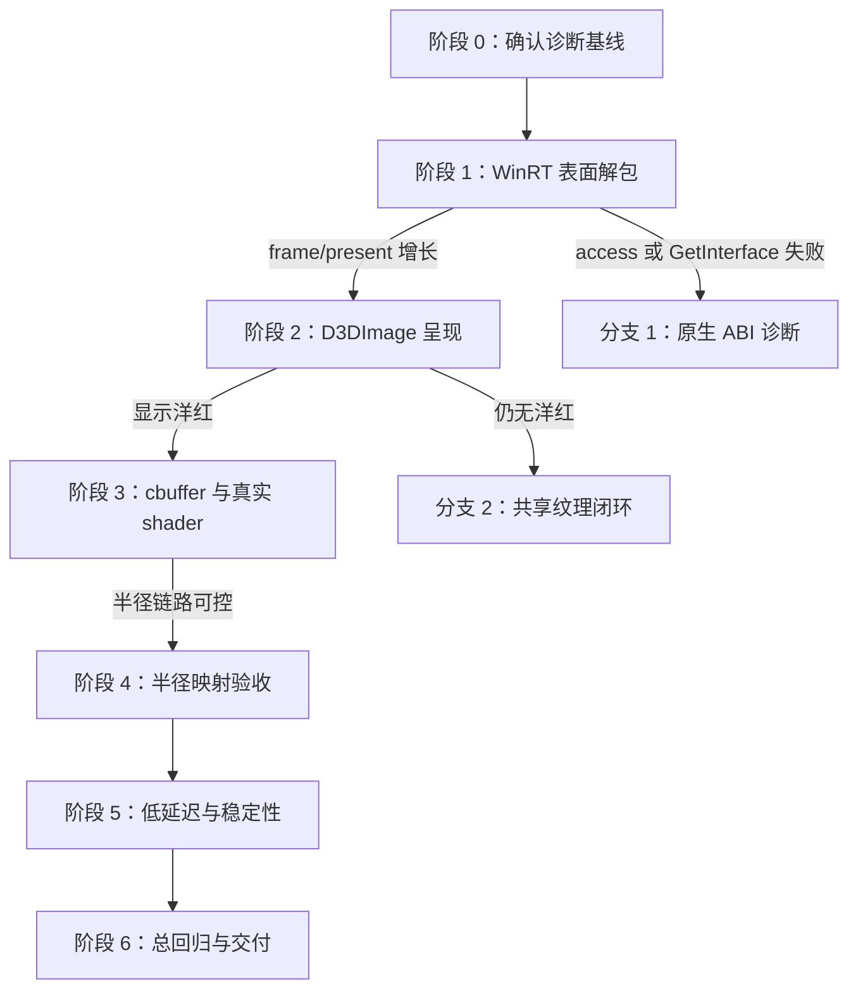

# DynamicIsland GPU 液态玻璃修复执行计划 V2

> 面向代码执行模型。规划者负责决策；执行模型只执行当前阶段；用户负责 Windows 实机观察与截图。
>
> **总目标**：让液态玻璃的“抓屏 → 裁剪 → 双遍模糊 → 共享纹理 → WPF 显示”完整运行在 GPU 路径上，不阻塞 UI；模糊半径实时、单调、肉眼可见地生效；GPU 失败时能可靠回退 HLSL。

---

## 1. 当前源码基线（执行前必须读）

本计划依据 `DynamicIsland_完整源码_v1.0_2026-07-20.zip` 的真实源码和 `PLAN_LOG.md` 制作。不要把历史文档中的推测当作已证实事实。

### 1.1 已由实机证实

| 事实 | 证据 |
|---|---|
| GPU 后端对象能构造，WinGC FramePool 回调能触发 | `wgc` 持续增长 |
| 主 GPU 后端没有收到纹理帧 | `frame=0` |
| D3DImage 呈现没有执行 | `present=0` |
| 当前可见的“固定模糊/底座”不是 GPU shader 输出 | V-pass 纯洋红已正确编译并嵌入，但实机没有洋红；禁用 DWM 底座后窗口全透明 |
| 当前失败发生在 `frame.Surface` 解包阶段 | `cast≈wgc`，`lastHr=0x80004002 (E_NOINTERFACE)` |

### 1.2 源码中仍保留的诊断状态

1. `LiquidGlass/Shaders/GaussianBlurV_D3D.hlsl/.cso` 是纯洋红 V-pass。
2. `GpuBlur.UpdateTexel` 仍写死 `tx=0.5f; ty=0.5f`。
3. `WinGCCapture.OnFrameArrived` 当前使用 `Marshal.GetIUnknownForObject(surface)`，并直接 QueryInterface `ID3D11Texture2D`。
4. `GpuGlassBackend.PresentOnUI` 当前在 `_d3dImage.Lock()` **之前**调用 `SetBackBuffer`。
5. `WindowBackdrop` 的 LiquidGlass 底座应保持 state2 透明穿透；不要在排查中改回 state4 亚克力。

### 1.3 必须废止的旧结论

- “`CreateDirect3D11DeviceFromDXGIDevice` 与 FramePool 不兼容”目前**没有被证明**。
- 随包备份里的 `GlassBench/WinGcFrameProbe.cs` 只验证了 FramePool 回调和 `TryGetNextFrame()`，没有验证 `frame.Surface → ID3D11Texture2D`。
- “GPU 模式已经几乎没有延迟”也不能作为成功证据：当时 `frame=0/present=0`，GPU 管线实际上处于空转状态。

---

## 2. 执行铁律

违反任意一条，本轮结果作废：

1. **每轮只改变一个故障层**。禁止同时修 WinRT 解包、D3DImage、shader 和性能。
2. 每轮流程固定：备份 → 修改 → 构建 → 实机观察 → 写日志 → 按判读表跳转。
3. 修改 `.hlsl` 后必须用 `fxc` 生成 `.cso`；只改 `.hlsl` 等于没有改运行程序。
4. 修改 `.cso` 后必须重新 `dotnet build`，因为程序读取 DLL 内嵌资源。
5. shader 诊断轮必须执行两次确认：`fxc /dumpbin` 检查反汇编；从构建 DLL 中提取资源并核对大小/hash。
6. 不新增 NuGet，不引入 Vortice、SharpDX、Silk.NET，不改 TFM，不改 x64。
7. 不允许 UI 线程调用 `_ctx11`。D3D11 immediate context 只在 WinGC/渲染线程使用。
8. 不吞新异常。诊断阶段必须记录计数、异常类型、HRESULT；禁止只写 `catch { }`。
9. 当前阶段未通过前，不得“顺手”清理诊断代码或优化其他模块。
10. 观察不在判读表内时，立即停止，把原始现象、计数和截图交回规划者。

### 常用命令

```powershell
dotnet build DynamicIsland/DynamicIsland.csproj -c Debug
```

```bash
FXC="/c/Program Files (x86)/Windows Kits/10/bin/10.0.26100.0/x64/fxc.exe"
export MSYS_NO_PATHCONV=1 MSYS2_ARG_CONV_EXCL='*'

"$FXC" /T ps_4_0 /O3 /E main \
  /Fo DynamicIsland/LiquidGlass/Shaders/GaussianBlurV_D3D.cso \
  DynamicIsland/LiquidGlass/Shaders/GaussianBlurV_D3D.hlsl

"$FXC" /dumpbin DynamicIsland/LiquidGlass/Shaders/GaussianBlurV_D3D.cso
```

---

## 3. 总决策树



---

## 4. 阶段 0：恢复基线与零改动确认

### 目的

确认执行模型拿到的是原始上传源码，不是其他临时修改版本。

### 操作

1. 从原始 ZIP 解压到新目录。
2. 确认以下三项仍存在：
   - V-pass `return float4(1,0,1,1)`；
   - `GpuBlur` 中 `tx=0.5f; ty=0.5f`；
   - `PresentOnUI` 中 `SetBackBuffer` 位于 `Lock` 之前。
3. 构建，要求 0 错 0 警。
4. 强制 GPU 模式运行 10 秒，记录设置页整行。

### 预期基线

```text
wgc 持续增长
frame=0
present=0
cast 持续增长
lastHr=0x80004002 或对应十进制值
```

不符合时停止；不要套用后续阶段。

---

## 5. 阶段 1：修通 WinRT `IDirect3DSurface` 解包

### 目的

只回答一个问题：能否把 WinGC 的 `frame.Surface` 正确取得为 `ID3D11Texture2D`，让 `GpuGlassBackend.OnFrameArrived` 真正开始运行？

### 允许修改

- 仅 `DynamicIsland/LiquidGlass/WinGCCapture.cs`
- 可同步追加 `PLAN_LOG.md`

### 禁止修改

- `CreateWinRTDevice` 的设备创建方案
- `GpuGlassBackend.PresentOnUI`
- D3D9/D3D11 共享纹理
- HLSL/CSO
- `GpuBlur`

### 实现要求

当前代码直接 QueryInterface `ID3D11Texture2D` 是错误路径。正确顺序必须是：

```text
frame.Surface
  → ((IWinRTObject)surface).NativeObject
  → AsInterface<IDirect3DDxgiInterfaceAccess>()
  → GetInterface(IID_ID3D11Texture2D)
  → ID3D11Texture2D
```

要求：

1. 不再对 `surface` 使用 `Marshal.GetIUnknownForObject`。
2. `cast` 仅统计取得 `IDirect3DDxgiInterfaceAccess` 失败。
3. `hr` 仅统计 `GetInterface` 返回失败。
4. `lastHr` 必须记录实际异常 `HResult` 或 `GetInterface` HRESULT。
5. 显式验证 `IID_ID3D11Texture2D` 等于：

   ```text
   6F15AAF2-D208-4E89-9AB4-489535D34F9C
   ```

6. 平衡 `GetInterface` 返回指针的引用计数，不能每帧泄漏一个纹理引用。
7. 不用视觉结果判断本阶段；只看计数器。

### 验收

构建后强制 GPU，等待 10 秒，记录整行：

| 观察 | 结论 | 跳转 |
|---|---|---|
| `wgc/frame/present` 同时增长，`cast=0, hr=0` | 表面解包成功 | → 阶段 2 |
| `wgc` 增长，`cast` 增长，`frame=0` | 访问接口转换仍失败 | → 分支 1A |
| `wgc` 增长，`cast=0`、`hr` 增长、`frame=0` | GetInterface 失败 | → 分支 1B |
| `frame` 增长、`present=0` | GPU 后端在 Present 前失败 | → 分支 1C |
| 程序崩溃/AccessViolation | COM ABI 或引用计数错误 | 立即停止，回规划者 |

### 分支 1A：访问接口仍为 E_NOINTERFACE

本分支仍只改 `WinGCCapture.cs`。

1. 记录 `surface.GetType().FullName`、异常类型、HRESULT。
2. 从 `((IWinRTObject)surface).NativeObject.ThisPtr` 取得真实 ABI 指针。
3. 对这个真实指针只 QueryInterface `IID_IDirect3DDxgiInterfaceAccess`，不要查询纹理 IID。
4. 分开记录 `nativeQiHr`。

判读：

| 观察 | 结论 | 下一步 |
|---|---|---|
| 原生 QI 成功、`AsInterface` 失败 | C#/WinRT 自定义 ComImport 包装问题 | 用原生接口指针调用 `GetInterface`；保持设备创建不变 |
| 原生 QI 仍为 E_NOINTERFACE | 结果违反 `IDirect3DSurface` 互操作契约，已超出普通修复范围 | 停止，回规划者；禁止直接改 Desktop Duplication |

### 分支 1B：访问接口成功但纹理 GetInterface 失败

1. 打印 `typeof(ID3D11Texture2D).GUID`，与标准 IID 比较。
2. 若 GUID 不同，只改为显式标准 IID再测一轮。
3. 若 GUID 正确且仍失败，停止并回传 HRESULT；不要尝试 SoftwareBitmap CPU 中转。

### 分支 1C：`frame` 增长但 `present=0`

在 `GpuGlassBackend.OnFrameArrived` 的四个节点分别加计数：

```text
copyOk → blurOk → flushOk → presentQueued
```

只加计数，不修逻辑。找到第一个不增长的节点后停止，交回规划者。

---

## 6. 阶段 2：修通 D3DImage 呈现并看见洋红

### 前置条件

`wgc/frame/present` 已同时增长，`cast=0, hr=0`。

### 目的

让当前纯洋红 V-pass 真正显示出来，从而证明：WinGC、D3D11 模糊入口、D3D9/D3D11 共享纹理与 D3DImage 至少形成可见闭环。

### 允许修改

- 仅 `DynamicIsland/LiquidGlass/GpuGlassBackend.cs`

### 实现要求

`PresentOnUI` 必须严格使用：

```text
D3DImage.Lock
  → 首次/换尺寸时 SetBackBuffer
  → AddDirtyRect
D3DImage.Unlock（finally）
```

要求：

1. `SetBackBuffer` 必须位于 `Lock` 与 `Unlock` 之间。
2. `Unlock` 必须在 `finally` 中执行。
3. `GetComInterfaceForObject` 得到的 `pSurface` 必须在 `finally` 中平衡释放。
4. 新增 `presentOk/presentFail/presentLastHr`；禁止继续吞异常。
5. 记录 `_d3dImage.IsFrontBufferAvailable`、`PixelWidth/PixelHeight`。
6. 本轮继续保留纯洋红 shader 和 `tx/ty=0.5`。

### 验收

| 观察 | 结论 | 跳转 |
|---|---|---|
| 胶囊稳定显示纯洋红，`presentOk` 增长、`presentFail=0` | GPU 可见闭环成功 | → 阶段 3 |
| 洋红出现但闪烁/局部更新 | 同步或 DirtyRect/尺寸问题 | → 分支 2A |
| `presentFail` 增长 | D3DImage 调用失败 | 按 `presentLastHr` 停止回传 |
| `presentOk` 增长但完全无洋红 | 呈现调用成功但共享内容不可见 | → 分支 2B |

### 分支 2A：洋红闪烁或局部显示

逐轮验证，不可合并：

1. DirtyRect 改用 `_d3dImage.PixelWidth/PixelHeight`，不要假设 `_texW/_texH` 与 D3DImage 实际尺寸相同。
2. 尺寸变化时先在 UI 线程解除旧 back buffer，再释放/替换旧 D3D9 surface。
3. 记录尺寸重建次数与前后尺寸。

仍异常则停止回规划者。

### 分支 2B：Present 成功但无洋红

先绕过 `GpuBlur` 做单变量实验：

1. 在渲染线程直接 `ClearRenderTargetView(OutputRtv, 纯洋红)`。
2. `Flush` 后照常 Present。

判读：

| 观察 | 结论 | 下一步 |
|---|---|---|
| 此时出现洋红 | D3D9/D3DImage 正常，故障在 GpuBlur/Draw | → 分支 2C |
| 仍无洋红 | 故障在 D3D11↔D3D9 共享纹理或 D3DImage | 做一次 D3D9 回读诊断后回规划者 |

D3D9 回读诊断只读一个或少量像素，且只运行一帧：

- 回读为洋红：共享纹理有内容，故障在 D3DImage。
- 回读非洋红：D3D11 写入或共享资源同步/目标错误。

### 分支 2C：GpuBlur 没有产生洋红

加 `blurEntered/midReady/drawH/drawV` 四个计数，确认第一次停止的位置。不得在同一轮改 shader 或 cbuffer。

---

## 7. 阶段 3：验证 cbuffer，恢复真实双遍模糊

### 前置条件

当前纯洋红 shader 已经稳定显示。

### 阶段 3A：cbuffer 灰度可视化

只修改 V-pass shader：

```hlsl
cbuffer CB : register(b0) { float2 TexelSize; };

float4 main(float4 pos : SV_POSITION, float2 uv : TEXCOORD) : SV_TARGET
{
    return float4(TexelSize.y, TexelSize.y, TexelSize.y, 1);
}
```

继续保留 C# 的 `tx=0.5f; ty=0.5f`。编译 CSO、build、双重验证嵌入。

| 观察 | 结论 | 跳转 |
|---|---|---|
| 稳定中灰 | cbuffer Map、绑定、shader 读取全部正常 | → 阶段 3B |
| 纯黑，`mapFail=0` | 写入成功但 PS 没读到 b0 | → 分支 3A-1 |
| `mapFail` 增长 | Map 路径失败 | → 分支 3A-2 |
| 非黑非灰或闪烁 | 数据布局/竞态 | 停止回规划者 |

#### 分支 3A-1：b0 绑定失效

1. 在 H-pass Draw 前显式 `PSSetConstantBuffers(0, cb)`。
2. 在 V-pass Draw 前再次显式绑定同一个 cb。
3. 每次只加一处，逐轮观察灰度。
4. 若 friendly 重载仍无效，再改原始 CsWin32 ABI 调用；不得同时修改 Map。

#### 分支 3A-2：Map 失败

1. 把异常类型、消息、HRESULT 暴露出来。
2. `CreateBuffer` 后立即 `GetDesc`，断言：
   - `ByteWidth=16`
   - `Usage=DYNAMIC`
   - `BindFlags=CONSTANT_BUFFER`
   - `CPUAccessFlags=WRITE`
3. 若描述正确仍失败，检查设备重建后 `_cbTexel` 是否属于当前 device。

### 阶段 3B：恢复真实 H/V shader

1. H-pass 应读取 `TexelSize.x`；V-pass 应读取 `TexelSize.y`。
2. 两者均为 9-tap，权值总和约为 1。
3. 优先以 `backups/plan-20260720/*.hlsl.bak` 为算法参考；不要盲用 1460-byte 的历史 CSO。
4. 重新编译 H/V CSO。
5. `/dumpbin` 必须在 H/V 两个 shader 中看到 `cb0`。
6. 从构建 DLL 提取两个内嵌 CSO，确认与磁盘新版一致。
7. 先把诊断 texel 从 `0.5` 改为 `0.02`，观察强模糊；再单独改为 `0.002`，观察轻模糊。

| 观察 | 结论 | 跳转 |
|---|---|---|
| `0.02` 与 `0.002` 明显不同 | 采样链路正常 | → 阶段 4 |
| 两者无差异 | SRV/sampler/viewport 或输入纹理错误 | → 分支 3B-1 |

#### 分支 3B-1：采样结果不随 texel 变化

逐项一轮：

1. H-pass 输入 SRV 是否为裁剪后的 `_inputTex`。
2. H-pass 输出 `_midRtv` 是否与 V-pass 输入 `_midSrv` 指向同一 `_midTex`。
3. sampler 是否 `LINEAR + CLAMP`。
4. viewport 是否等于当前纹理物理尺寸。
5. H/V Draw 前是否绑定了正确 PS、SRV、sampler、cbuffer。

遇到未覆盖现象停止。

---

## 8. 阶段 4：恢复真实滑块并校准半径映射

### 操作

1. 删除 `GpuBlur.UpdateTexel` 中 `tx=0.5f; ty=0.5f`。
2. 恢复使用 `Configure` 写入、渲染线程 `Volatile.Read` 读取的真实值。
3. 在后端名称中临时显示：

   ```text
   radius / appliedTexelX / appliedTexelY / textureSize
   ```

4. 同一桌面背景、同一岛尺寸分别测试滑块：0、25、60、100。
5. 每档停留 2 秒并截图；拖动时观察是否即时变化，无需重启或切换后端。

### 核心验收

- 0 必须接近锐利原图。
- 25、60、100 必须单调增强，至少三档肉眼可区分。
- 水平与垂直不得出现明显方向性拉伸。
- 收起态和展开态都必须成立。
- `mapFail/cast/hr/presentFail` 全部保持 0。

### 分支 4A：滑块仅低段变化，高段很快饱和

当前代码分别以 `w/6` 和 `h/6` 钳制半径，扁平胶囊会导致水平/垂直采样尺度严重不同。若实机证实饱和或横向拖影，改为统一的等向像素步长：

```text
t = slider / 100
maxStep = min(width, height) / 8
stepPixels = t * maxStep
texelX = stepPixels / width
texelY = stepPixels / height
```

要求：

1. GPU 与 HLSL 后端使用同一映射，避免切后端视觉跳变。
2. 映射修改单独一轮；不得同时改权值或 tap 数。
3. 再次完成 0/25/60/100 截图对比。

若 `/8` 的最大效果过强或过弱，只允许规划者根据截图调整分母；执行模型不得自行试多个魔法数字。

---

## 9. 阶段 5：低延迟、稳定性与资源治理

前四阶段全部通过后才进入本阶段。

### 5A：Present 队列合并

当前每帧 `Dispatcher.BeginInvoke(PresentOnUI)` 可能在 UI 忙时形成旧帧积压。增加一个原子 `presentPending`：队列中已有 Present 时不再重复排队，让 UI 总是显示共享纹理中的最新帧。

验收：

- `presentQueued - presentExecuted` 长期不超过 1。
- 快速 hover/展开时无越来越严重的延迟。

### 5B：GPU 假运行与回退

当前 WinGC 回调增长但纹理提取失败时，GPU 后端不会进入 `RegisterEmpty`，会永久显示“GPU”但不出帧。

增加启动看门狗：

- 启动后 2 秒内 `frame=0`，请求回退。
- 连续纹理提取失败达到阈值，回退。
- Auto 模式允许回退 HLSL。
- 强制 GPU 模式应明确显示错误状态，不伪装为正常 GPU；是否回退按产品设定，但必须可见。

### 5C：FrontBuffer 与尺寸重建

1. 处理 `IsFrontBufferAvailableChanged`。
2. front buffer 恢复时重新 SetBackBuffer。
3. 岛尺寸变化时，先安全解绑旧 back buffer，再替换共享 surface。
4. 跨显示器时重建捕获 item/session，不能继续裁剪旧显示器纹理。

### 5D：COM 引用与设备异常

审计以下所有原始指针：

- `CreateDirect3D11DeviceFromDXGIDevice` 返回的 `inspectablePtr`
- `CreateForMonitor` 返回的 `itemPtr`
- `GetInterface` 返回的纹理指针
- `OpenSharedResource` 返回的纹理指针
- VS/PS 创建返回的原始接口指针
- D3DImage 使用的 `IDirect3DSurface9` 指针

每个指针必须明确“谁拥有初始引用、谁 AddRef、谁 Release”。禁止靠 GC 猜测。

### 性能验收

在同一动态壁纸/视频背景、同一岛尺寸下，对 GPU 与 HLSL 各测试 60 秒：

| 指标 | GPU 合格线 |
|---|---|
| WinGC 回调率 | 稳态约 50–60 fps |
| GPU 处理帧率 | 不低于回调率的 90% |
| Present 执行率 | 无持续积压；队列深度 ≤1 |
| UI Dispatcher 延迟 | p95 < 4 ms，最大值通常 < 16 ms |
| 视觉延迟 | 背后窗口移动到玻璃更新不超过约 2 帧 |
| CPU 占用 | 同场景明显低于 HLSL；目标至少降低 30% |
| 内存/句柄 | 预热后运行 10 分钟无持续线性增长；私有内存增长 <20 MB，GDI/USER 句柄稳定 |
| 错误计数 | `cast/hr/mapFail/presentFail` 均保持 0 |

硬件差异导致绝对 CPU 数值不同时，以同机同场景的相对比较为准。

---

## 10. 阶段 6：总回归验收

### 功能

- [ ] Auto 默认选择 GPU，设置页显示真实运行状态。
- [ ] 强制 GPU 能稳定显示液态玻璃。
- [ ] 强制 HLSL 仍正常工作。
- [ ] 半径 0/25/60/100 单调、实时生效。
- [ ] 底色浓度独立生效，不改变模糊半径。
- [ ] 主题深浅色切换正常。
- [ ] 重启后设置持久化。

### 动画与布局

- [ ] 收起、hover、展开、提醒态尺寸变化均无黑帧、旧帧或拉伸。
- [ ] 全屏抽纸进出正常。
- [ ] 媒体、天气、提醒、Mood 边光、Ultra 彩虹正常。
- [ ] 圆角外区域无矩形残影。

### 系统场景

- [ ] 100%/125%/150% DPI。
- [ ] 主屏与副屏，包含负坐标显示器。
- [ ] 跨屏移动后捕获源正确。
- [ ] 锁屏/解锁后恢复。
- [ ] 显示器休眠/唤醒后恢复。
- [ ] 全屏独占应用前后不永久黑屏。
- [ ] 显卡设备异常时能回退或明确报错。

### 清理

- [ ] 恢复真实 V-pass，不含纯洋红返回。
- [ ] 删除灰度可视化 shader。
- [ ] 删除 `tx=0.5f; ty=0.5f`。
- [ ] 保留低成本健康计数；删除高成本像素回读。
- [ ] 所有空 `catch { }` 至少在 GPU 主链路中被替换为可诊断处理。
- [ ] 构建 0 错 0 警。

---

## 11. 执行模型每轮固定汇报格式

```text
【阶段/分支】
修改文件：
唯一修改变量：
关键 diff：
shader 编译结果（如适用）：
dotnet build：
运行前计数：
运行 10 秒后计数：
用户肉眼观察：
命中的判读表行：
下一跳：
是否存在未覆盖现象：是/否
```

不得用“应该、估计、可能修好了”代替计数和用户观察。

---

## 12. 必须停止并回来找规划者的条件

出现任意一条，执行模型不得继续：

1. `NativeObject.ThisPtr` 原生 QI `IDirect3DDxgiInterfaceAccess` 仍为 E_NOINTERFACE。
2. 发生 AccessViolation、COM 崩溃、设备移除或 UI/D3D 死锁。
3. D3D9 回读与 D3DImage 显示结果互相矛盾。
4. 观察结果不在当前阶段判读表中。
5. 修复需要新 NuGet、换图形库、换 TFM 或改用 Desktop Duplication。
6. 单一阶段需要同时修改三个以上运行时代码文件。
7. 构建出现与当前修改无关的新错误。
8. 性能指标通过但画面存在明显拖影/闪烁，或画面正确但 UI 延迟仍高。

回来时必须携带：当前源码 ZIP、`PLAN_LOG.md`、设置页整行计数、构建输出、截图/录屏和最近一轮 diff。

---

## 13. 最终交付物

- 修复后的完整源码 ZIP。
- 完整 `PLAN_LOG.md`，每轮都有“改动 → 观察 → 判读 → 跳转”。
- 0/25/60/100 半径对比截图。
- GPU/HLSL 60 秒性能对照表。
- 10 分钟稳定性记录。
- 一段最终根因说明：
  - WinRT 表面解包为何失败；
  - D3DImage 为什么没有显示；
  - 模糊半径链路最终如何恢复；
  - 为什么历史观察会被 DWM 底座误导。
